# Car Survey

Car Survey allows users to fill out a basic survey and search for existing surveys based on either manufacturer, model and/or year.

## Live site
[Car Survey](https://car-survey.herokuapp.com/)

## Project Goals

The idea of Car Survey was for people in the market of purchasing a car, be able to easily view surveys of real world owners of the vehicle.  From this idea I wanted to:

  - To enter basic vehicle details
  - To enter basic user details
  - Save this data to an external spreadsheet
  - Import back into the program and print when required
  
## Database Structure

Google Sheets is used to store all user inputs. 

Table consists of 8 columns: Name, Age, Make Of Car, Model Of Car, Year Of Car, Owned Since, Pros and Cons.

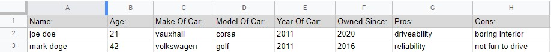

Each column has individually assigned values that the end user has entered.  Each of the inputs have maximum character limits, exceeding them will display an error and prompt the user to try again. 

## Features

### Introduction

Start screen of the program consists of a welcome message, an explanantion of the program and one option.  The input is validated and an error is thrown if it does not match the requirements.

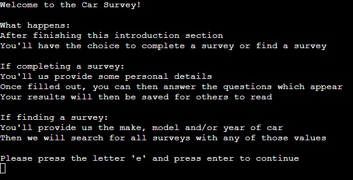

### Complete Survey or Find Survey

Here the user as the option of either completing a survey or finding a survey.  The input is validated and an error is thrown if it does not match the requirements.

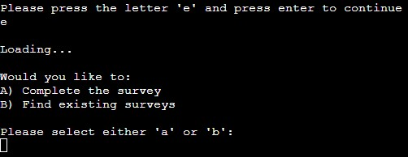

### Name Input

The user can enter their name, including their surname if desired.  The input is validated and an error is thrown if the input includes numbers, is left blank or if the input exceeds 20 characters.

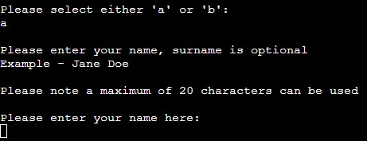

### Age Input

The user can enter their age here.  Input is validated and an error is thrown if the input includes letters, left blank or exceeds 3 digits.

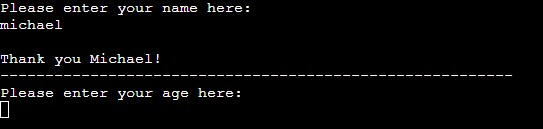

### Manufacturer Input (Completing Survey)

The user can enter the manufacturer of their car. Input is validated and an error is thrown if the input contains numbers, is left blank or exceeds 20 characters.

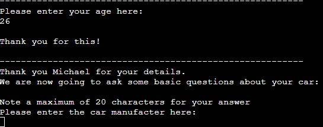

### Model Input (Completing Survey)

The user can enter the model of their car. Input is validated and an error is thrown if the input is left blank or exceeds 20 characters.

### Year Input (Completing Survey)

The user can enter the year of their car. Input is validated and an error is thrown if the input contains letters, left blank or exceeds 4 digits.

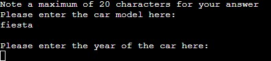

### Car Details Check

The user is shown the values they just inputted. From here they have the choice of continuing with the survey, or if a mistake was made they can go back through the last three questions. Input is validated and an error is thrown if the input doesn't match the requirements. 

### Question One

The user is shown the first question out of three.  The input is validated and an error is thrown if it contains letters, is left blank or exceeds 4 digits.

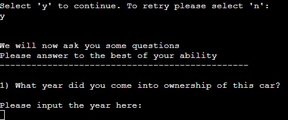

### Question Two

The user is then shown the second question. Input is validated and an error is thrown if it is left blank or exceeds 20 characters.

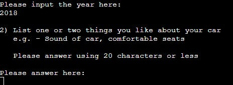

### Question Three

The user is finally shown the last question. Input is validated and an error is throw if it is left blank or exceeds 20 characters.

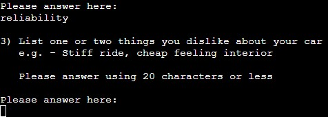

### Question Input Check

The user is show the answers they just entered for the questions. They have the choice of confirming their answers, or they can go through the questions again and change answers if needed. Input is validated and an error is thrown if the input doesn't match the requirements.

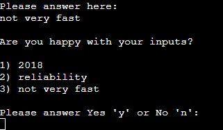

### Updated Worksheet & Final Options

Here the user has a message to let them know that the worksheet has been updated with their data.  They then have the option to find existing surveys, complete the survey again or exit out of the program. The input is validated and an error is thrown if the input doesn't match the requirements.

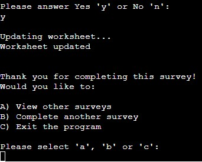

### Finding Surveys

The user has 5 different options to choose from.  The input is validated and an error is thrown if the input doesn't match the requirements.

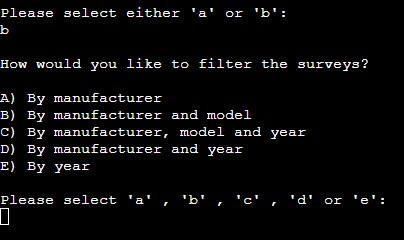

### Finding Survey via a Manufacturer

If the user selected 'a' they will be asked to input a manufacturer. Input is validated and an error is thrown if it contains numbers or if left blank. User can input as many letters as they want but will no results will appear.  If the database does not contain a manufacturer matching the input, a message will appear letting the user know. 

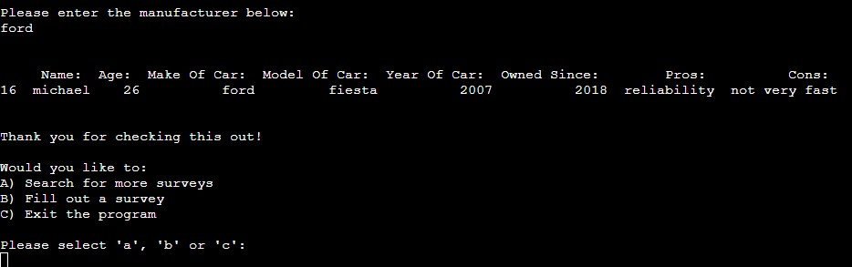

### Finding Survey via Manufacturer and Model

If the user selected 'b' they will be asked to input a manufacturer and model. As inputs are seperate, they are validated on their own. Manufacturer input will throw an error if left blank or containing numbers. The model input will throw an error if left blank, there is also no limit to number of characters being inputted. If database does not contain a manufacturer and model matching the inputs, a message will appear letting the user know.

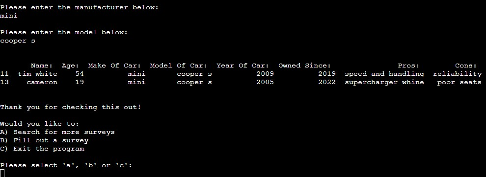

### Finding Survey via Manufacturer, Model and Year

If the user selected 'c' they will be asked to input a manufacturer, model and year. As inputs are seperate, they are each validated on their own. Manufacturer input will throw an error if left blank or containing numbers. Model input will throw an error if left blank. The year input will throw an error if left blank or containing letters, again no limit to number of characters being inputted.  If database does not contain the manufacturer, model and year matching the inputs a message will appear letting the user know. 

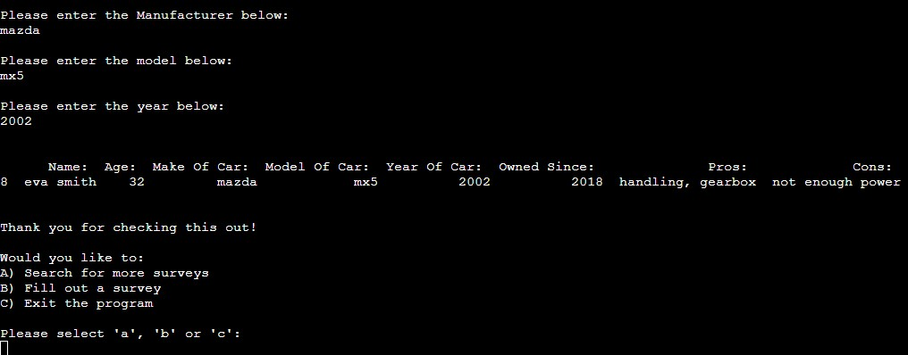

### Finding Survey via Manufacturer and Year

If the user selected 'd' they will be asked to input a manufacturer and year. As inputs are seperate, they validated on their own. Manufacturer input will throw an error if left blank or containing numbers. The year input will throw an error if left blank or containing letters, no limit to number of characters being inputted. If database does not contain the manufacturer and year matching the inputs a message will appear letting the user know. 

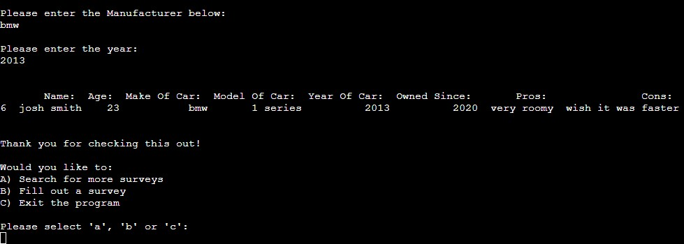

### Finding Survey via the Year & After Survey Options

If the user selected 'e' they will be asked to input a manufacturer and year. Input is validated and an error is thrown if it contains letters or if left blank. User can input as many characters as they want. If the database does not contain any year matching the input,  a message will appear letting the user know. 

At the same time of any surveys being printed, an option list will be printed underneath. This gives the user the option to search for a survey again, complete a survey or exit the program.

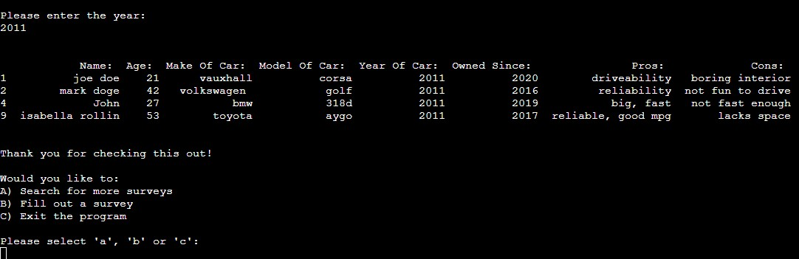

## Python Libraries/Modules

  - [gspread](https://docs.gspread.org/en/v5.7.0/) - Used to control Google Sheets API
  - [oauthlib](https://pypi.org/project/oauthlib/) - Used to manage HTTP request and authenticate to Google Sheets API
  - [pandas](https://pandas.pydata.org/) - Used to manipulate imported data for user to view

## Validation

[PEP8CI](https://pep8ci.herokuapp.com/) was used to validate the code, no errors were found.

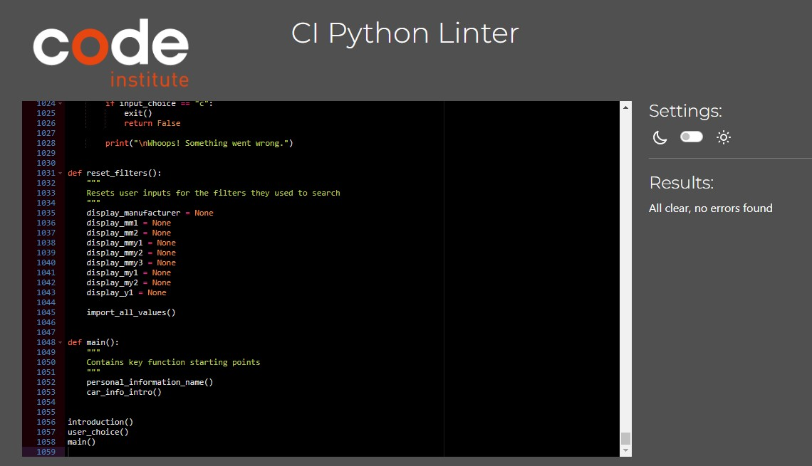

## Known Issues

 - When user is prompted for a text base input (name, manufacturer etc), they can input punctation marks which will be marked as valid data. This allows the user to proceed and save useless 
   data to the spreadsheet.

## Future Features

For future features I'd like to:

 - Use colours for errors, questions, inputs etc
 - Print a random survey when requested
 - Prompt more questions

## Deployment to Heroku

1. Visited [Heroku](https://heroku.com/) and opened dashboard. Then selected "New", from the drop down I chose "Create new app".
2. I put my name as "car-survey", selected Europe as my region. Then "Create app".

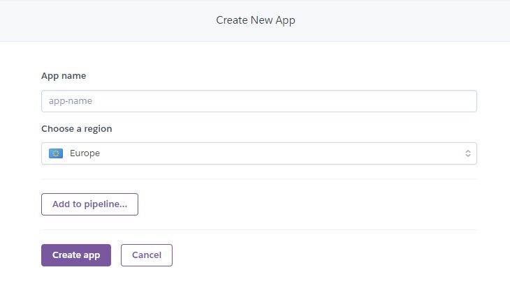

3. Once created go to "Deploy" then under "Deployment method" select GitHub and connect account.

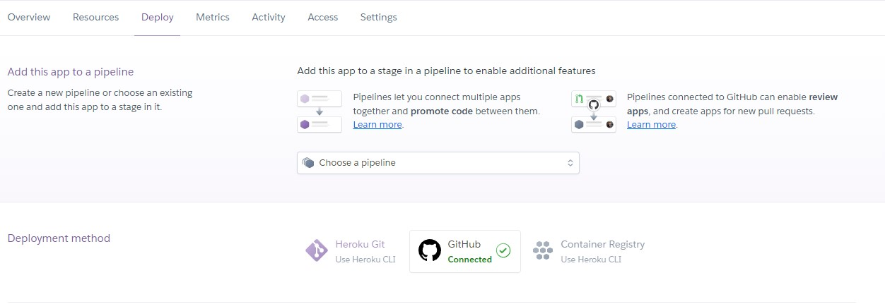

4. Once connected, I selected main branch from "car-survey" repository.

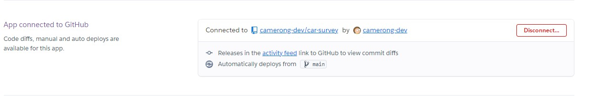

5. From there I go to the "Settings" tab.
6. Then I go to "Config Vars" section and added the key "CREDS" then copy and pasted all data within my CREDS file.
7. After CREDS have been added, I add key "PORT" with value "8000".

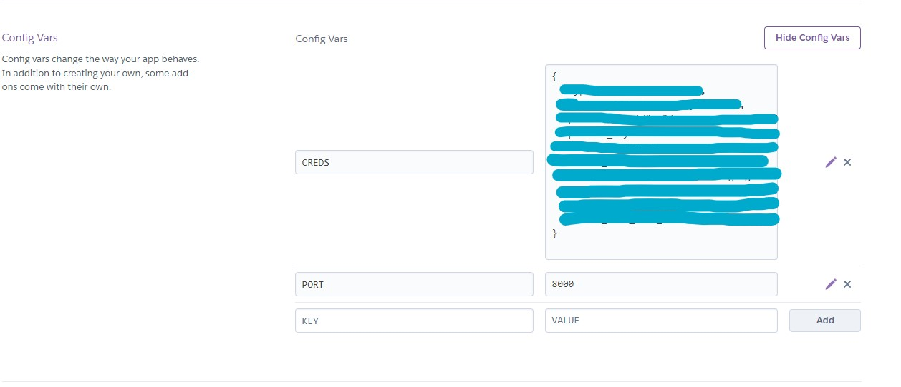

8. Once "Config Vars" has been filled out, I go to "Buildpacks" section. I add python and nodejs. Python must come before the nodejs buildpack.

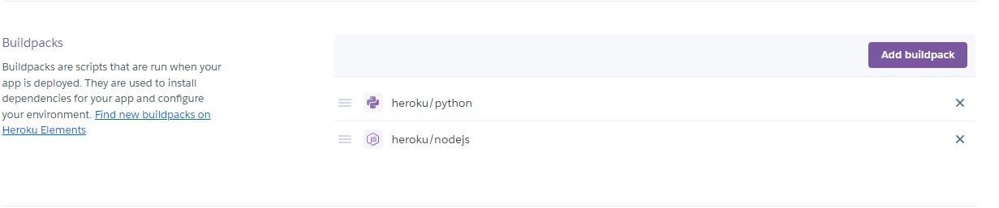

9. I then go back to the "Deploy" tab and enable automatic deploys. 

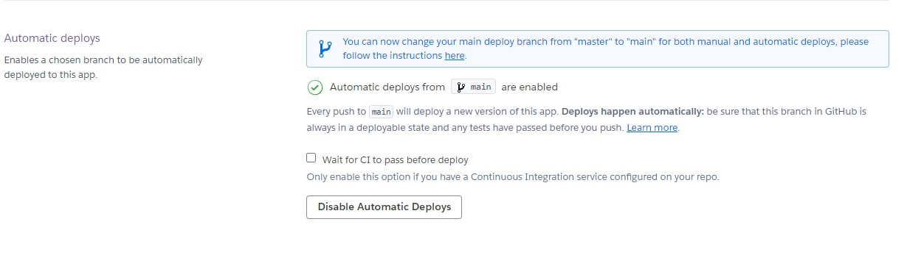

10. Link of deployed app was shown on screen as - https://car-survey.herokuapp.com/

## Credits

### Code

 - Google Sheets API connection method is taken from Love Sandwiches walkthrough project
 - Try and Except method was influenced from Love Sandwiches walkthrough
 - Dave Horrocks on CI Slack helped on splitting a list
 - Jo Heyndels on CI Slack helped debug and solve issue

### Resources

 - Code Institute Project 3 Walkthrough
 - [StackOverflow](https://stackoverflow.com)
 - [Pandas documentation](https://pandas.pydata.org/docs/user_guide/index.html)
 - [Gspread documentation](https://docs.gspread.org/en/v5.7.0/)
 - [W3Schools](https://www.w3schools.com/python/default.asp)
 - [GeeksForGeeks](https://www.geeksforgeeks.org/python-programming-language/?ref=shm)