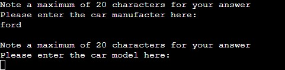

# Car Survey

Car Survey allows users to fill out a basic survey and search for existing surveys based on either manufacturer, model and/or year.

## Live site
[Car Survey](https://car-survey.herokuapp.com/)

## Project Goals

The idea of Car Survey was for people in the market of purchasing a car, be able to easily view surveys of real world owners of the vehicle.  From this idea I wanted to:

  - To enter basic vehicle details
  - To enter basic user details
  - Save this data to an external spreadsheet
  - Import back into the program and print when required
  
## Database Structure

Google Sheets is used to store all user inputs. 

Table consists of 8 columns: Name, Age, Make Of Car, Model Of Car, Year Of Car, Owned Since, Pros and Cons.

Each column has individually assigned values that the end user has entered.  Each of the inputs have maximum character limits, exceeding them will display an error and prompt the user to try again. 

## Features

### Introduction

Start screen of the program consists of a welcome message, an explanantion of the program and one option.  The input is validated and an error is thrown if it does not match the requirements.

### Complete Survey or Find Survey

Here the user as the option of either completing a survey or finding a survey.  The input is validated and an error is thrown if it does not match the requirements.

### Name Input

The user can enter their name, including their surname if desired.  The input is validated and an error is thrown if the input includes numbers, is left blank or if the input exceeds 20 characters.

### Age Input

The user can enter their age here.  Input is validated and an error is thrown if the input includes letters, left blank or exceeds 3 digits.

### Manufacturer Input (Completing Survey)

The user can enter the manufacturer of their car. Input is validated and an error is thrown if the input contains numbers, is left blank or exceeds 20 characters.

### Model Input (Completing Survey)

The user can enter the model of their car. Input is validated and an error is thrown if the input is left blank or exceeds 20 characters.

### Year Input (Completing Survey)

The user can enter the year of their car. Input is validated and an error is thrown if the input contains letters, left blank or exceeds 4 digits.

### Car Details Check

The user is shown the values they just inputted. From here they have the choice of continuing with the survey, or if a mistake was made they can go back through the last three questions. Input is validated and an error is thrown if the input doesn't match the requirements. 

### Question One

The user is shown the first question out of three.  The input is validated and an error is thrown if it contains letters, is left blank or exceeds 4 digits.

### Question Two

The user is then shown the second question. Input is validated and an error is thrown if it is left blank or exceeds 20 characters.

### Question Three

The user is finally shown the last question. Input is validated and an error is throw if it is left blank or exceeds 20 characters.

### Question Input Check

The user is show the answers they just entered for the questions. They have the choice of confirming their answers, or they can go through the questions again and change answers if needed. Input is validated and an error is thrown if the input doesn't match the requirements.

### Updated Worksheet & Final Options

Here the user has a message to let them know that the worksheet has been updated with their data.  They then have the option to find existing surveys, complete the survey again or exit out of the program. The input is validated and an error is thrown if the input doesn't match the requirements.

### Filteri
